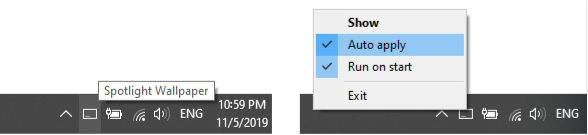
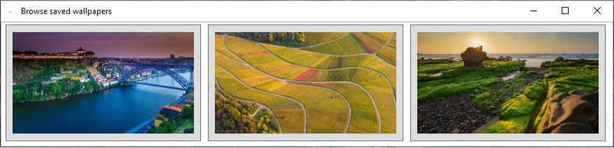

# Spotlight Wallpaper

When you really like it, apply the Spotlight image of the login screen as a wallpaper on all your monitors respecting the orientation.

It runs as system tray icon and you are able to enable the *`Run on start`* and *`Auto apply`* options.

You can change to previous wallpapers:

## Features
* Show current Login screen Spotlight image after unlock Windows
* Apply the wallpaper on all monitors depending each orientation
* Browse previous saved images and apply them as wallpaper
* Manually decide if save pictures for later or apply now (also skip them)
* Auto set wallpaper afyer each login (configurable)

## Instalation
- Requires Microsoft Windows 10
- Requires Microsoft .NET Framework Runtime 4.7.2, download it from https://dotnet.microsoft.com/download/dotnet-framework/net472

## TODO List:
- Delete pictures from the gallery
- Change picture save location

## Licence

Copyright ©2019 Ricardo Tejo

MIT License:

Permission is hereby granted, free of charge, to any person obtaining a copy of this software and associated documentation files (the "Software"), to deal in the Software without restriction, including without limitation the rights to use, copy, modify, merge, publish, distribute, sublicense, and/or sell copies of the Software, and to permit persons to whom the Software is furnished to do so, subject to the following conditions:

The above copyright notice and this permission notice shall be included in all copies or substantial portions of the Software.

THE SOFTWARE IS PROVIDED "AS IS", WITHOUT WARRANTY OF ANY KIND, EXPRESS OR IMPLIED, INCLUDING BUT NOT LIMITED TO THE WARRANTIES OF MERCHANTABILITY, FITNESS FOR A PARTICULAR PURPOSE AND NONINFRINGEMENT. IN NO EVENT SHALL THE AUTHORS OR COPYRIGHT HOLDERS BE LIABLE FOR ANY CLAIM, DAMAGES OR OTHER LIABILITY, WHETHER IN AN ACTION OF CONTRACT, TORT OR OTHERWISE, ARISING FROM, OUT OF OR IN CONNECTION WITH THE SOFTWARE OR THE USE OR OTHER DEALINGS IN THE SOFTWARE.

